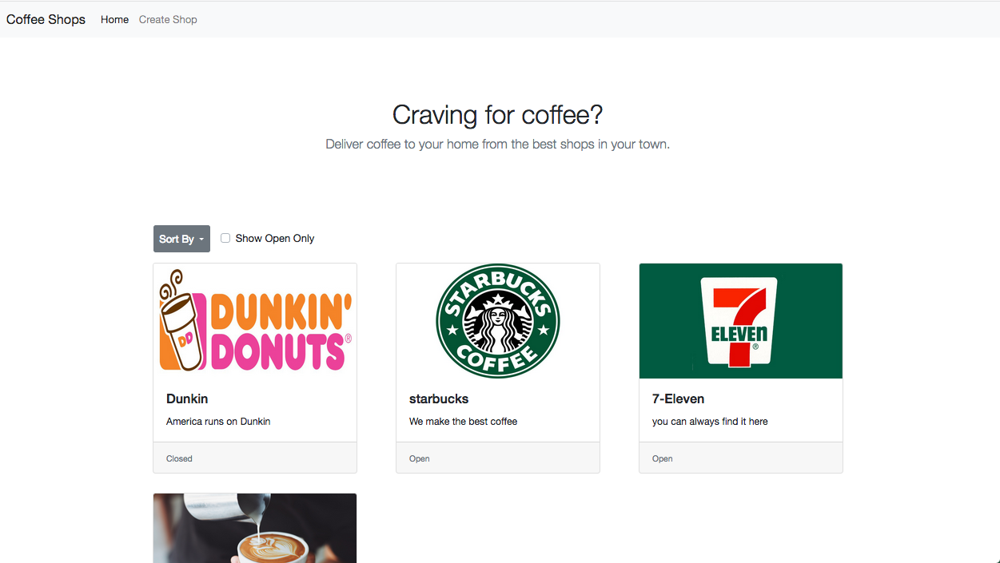

# Doordash style website demo for coffee

## Information
This is a sample app for Doordash style app for coffee shop.
This is built using bootstrap, jquery on Front End and
sanic python server on back end (mainly for fetching data)

You can point your browser to open `index.html` to open the app.

This app
- landing page that lists all stores
- allow landing page to sort items by name and state
- allow user to create new shop with items
- single page for shop's menu

The app has some testdata included. You can add more store as needed.

## Installation
Make sure you have python3 installed to run this server.
You can install python dependencies by running `pip install -r requirements.txt`

## Starting Server
`python python_server.py`

current application will require to python server to fetch data.
By default it will start the server on port 8000.

